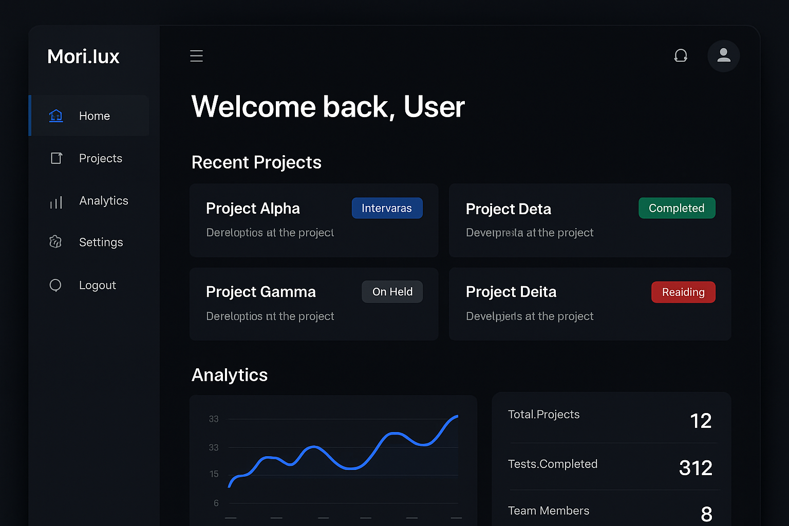

# Mori.lux - Plataforma de Inteligência Artificial


## Sobre o Projeto

**Mori.lux** é uma plataforma inovadora de inteligência artificial que oferece soluções avançadas em automação de processos, análise de dados e geração de conteúdo inteligente. Desenvolvida com tecnologias de ponta, a plataforma integra chatbots avançados, análise preditiva e ferramentas de otimização para empresas de todos os tamanhos.

## Características Principais

A plataforma Mori.lux oferece um conjunto completo de recursos para transformar negócios através da inteligência artificial:

**Automação Inteligente** - Reduza a carga manual de tarefas repetitivas através de algoritmos de aprendizado de máquina que se adaptam aos padrões específicos de trabalho.

**Análise Preditiva** - Obtenha insights acionáveis sobre tendências futuras e tome decisões baseadas em dados com maior confiança.

**Geração de Conteúdo** - Automatize a criação de conteúdo de alta qualidade, desde relatórios técnicos até materiais de marketing.

**Integração Sem Fricção** - Conecte-se facilmente com sistemas existentes através de APIs bem documentadas e conectores pré-construídos.

## Visualização do Projeto

### Homepage
A página inicial apresenta a proposta de valor da plataforma com um design moderno e profissional.


### Dashboard do Usuário
Interface intuitiva para gerenciar projetos, acompanhar analytics e controlar automações.



## Stack Tecnológico

| Componente | Tecnologia | Descrição |
|---|---|---|
| Frontend | React 19 + Tailwind CSS 4 | Interface responsiva e moderna |
| Backend | Express.js 4 + Node.js | Servidor robusto e de alta performance |
| API | tRPC 11 | Type-safe RPC com end-to-end typing |
| Banco de Dados | MySQL/TiDB | Armazenamento relacional escalável |
| ORM | Drizzle ORM | Query builder type-safe |
| Autenticação | Manus OAuth | Gerenciamento seguro de identidade |
| Armazenamento | AWS S3 | Armazenamento de arquivos em nuvem |
| IA | LLM Integration | Modelos de linguagem avançados |

## Estrutura do Projeto

```
Mori.lux/
├── client/                    # Aplicação frontend React
│   ├── src/
│   │   ├── pages/            # Componentes de páginas
│   │   ├── components/       # Componentes reutilizáveis
│   │   ├── contexts/         # React contexts
│   │   ├── hooks/            # Custom hooks
│   │   └── lib/              # Utilitários
│   └── public/               # Ativos estáticos
├── server/                    # Aplicação backend Express
│   ├── routers.ts            # Procedimentos tRPC
│   ├── db.ts                 # Helpers de banco de dados
│   └── _core/                # Infraestrutura
├── drizzle/                   # Schema do banco de dados
├── shared/                    # Código compartilhado
├── DESIGN_GUIDE.md           # Guia de design visual
├── EXPLICACAO_PROJETO.md     # Documentação completa
└── todo.md                   # Rastreamento de features
```

## Paleta de Cores

A plataforma utiliza uma paleta de cores baseada em tons de azul profundo, transmitindo confiança e inovação.

| Cor | Código HEX | Uso |
|---|---|---|
| Azul Escuro | `#0F172A` | Backgrounds principais |
| Azul Profundo | `#1E3A8A` | Backgrounds secundários |
| Azul Brilhante | `#3B82F6` | Botões e destaques |
| Azul Claro | `#60A5FA` | Hover states |

Para mais detalhes sobre o design, consulte [DESIGN_GUIDE.md](./DESIGN_GUIDE.md).

## Guia de Início Rápido

### Pré-requisitos

- Node.js 18+
- pnpm ou npm
- Banco de dados MySQL/TiDB

### Instalação

```bash
# Clonar o repositório
git clone https://github.com/EmersonXPro/Mori.lux.git
cd Mori.lux

# Instalar dependências
pnpm install

# Configurar variáveis de ambiente
cp .env.example .env.local

# Executar migrações do banco de dados
pnpm db:push

# Iniciar servidor de desenvolvimento
pnpm dev
```

O servidor estará disponível em `http://localhost:3000`.

## Desenvolvimento

### Fluxo de Desenvolvimento

1. **Atualizar Schema** - Modifique `drizzle/schema.ts` e execute `pnpm db:push`
2. **Implementar Helpers** - Adicione funções em `server/db.ts`
3. **Criar Procedimentos** - Defina novos procedimentos em `server/routers.ts`
4. **Desenvolver Frontend** - Implemente UI em `client/src/pages/`

### Comandos Úteis

```bash
# Desenvolvimento
pnpm dev              # Inicia servidor de desenvolvimento

# Banco de dados
pnpm db:push         # Aplica migrações
pnpm db:studio       # Abre Drizzle Studio

# Build
pnpm build           # Compila para produção

# Testes
pnpm test            # Executa testes
pnpm test:watch      # Modo watch
```

## Documentação

- [EXPLICACAO_PROJETO.md](./EXPLICACAO_PROJETO.md) - Documentação técnica completa
- [DESIGN_GUIDE.md](./DESIGN_GUIDE.md) - Guia de design visual
- [tRPC Documentation](https://trpc.io/docs)
- [Tailwind CSS](https://tailwindcss.com/docs)
- [Drizzle ORM](https://orm.drizzle.team/docs/overview)

## Recursos Principais

### Autenticação OAuth
Sistema robusto de autenticação integrado com Manus OAuth para gerenciamento seguro de identidade.

### Integração com LLM
Modelos de linguagem avançados para processamento de texto, geração de conteúdo e análise.

### Armazenamento em Nuvem
Arquivos armazenados em AWS S3 com metadados gerenciados no banco de dados.

### Dashboard Personalizado
Interface intuitiva para gerenciar projetos, acompanhar analytics e controlar automações.

## Contribuindo

As contribuições são bem-vindas! Por favor:

1. Faça um fork do projeto
2. Crie uma branch para sua feature (`git checkout -b feature/AmazingFeature`)
3. Commit suas mudanças (`git commit -m 'Add some AmazingFeature'`)
4. Push para a branch (`git push origin feature/AmazingFeature`)
5. Abra um Pull Request

## Licença

Este projeto está licenciado sob a MIT License - veja o arquivo LICENSE para detalhes.

## Contato

Para dúvidas ou sugestões, entre em contato através de:

- Email: contato@mori.lux
- GitHub: [EmersonXPro](https://github.com/EmersonXPro)
- Website: [mori.lux](https://mori.lux)

## Agradecimentos

Desenvolvido com ❤️ por [Emerson Xavier](https://github.com/EmersonXPro) usando Manus AI.

---

**Última atualização:** Novembro 2025
